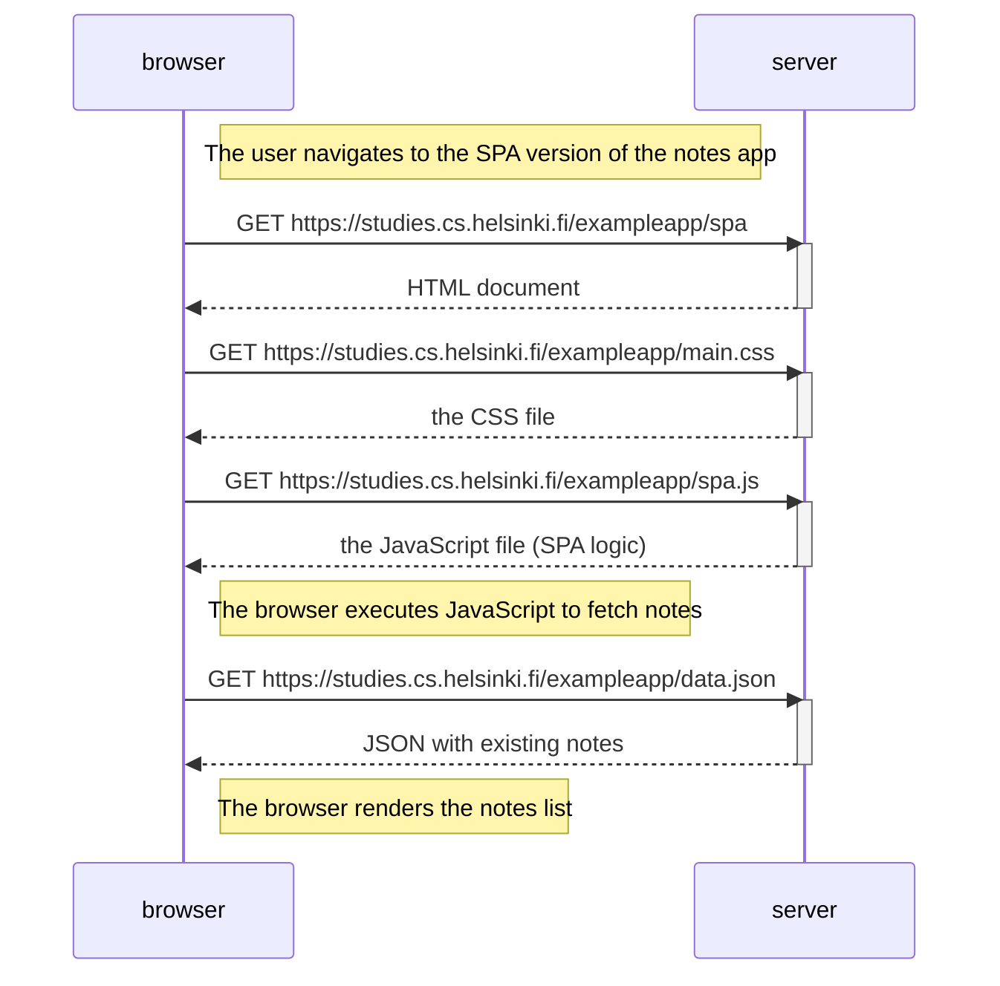

```mermaid
sequenceDiagram
    participant browser
    participant server

    Note right of browser: The user navigates to the SPA version of the notes app
    browser->>server: GET https://studies.cs.helsinki.fi/exampleapp/spa
    activate server
    server-->>browser: HTML document
    deactivate server

    browser->>server: GET https://studies.cs.helsinki.fi/exampleapp/main.css
    activate server
    server-->>browser: the CSS file
    deactivate server

    browser->>server: GET https://studies.cs.helsinki.fi/exampleapp/spa.js
    activate server
    server-->>browser: the JavaScript file (SPA logic)
    deactivate server

    Note right of browser: The browser executes JavaScript to fetch notes
    browser->>server: GET https://studies.cs.helsinki.fi/exampleapp/data.json
    activate server
    server-->>browser: JSON with existing notes
    deactivate server

    Note right of browser: The browser renders the notes list
```