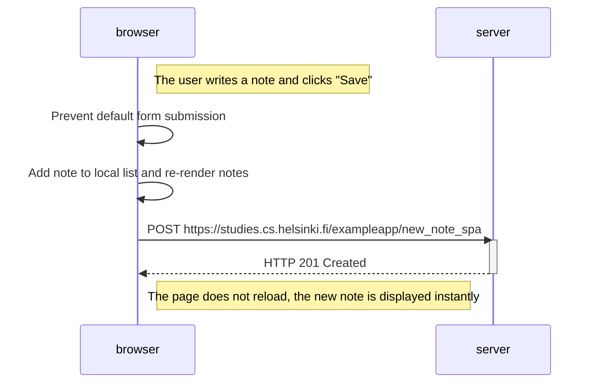

```mermaid
sequenceDiagram
    participant browser
    participant server

    Note right of browser: The user writes a note and clicks "Save"
    browser->>browser: Prevent default form submission
    browser->>browser: Add note to local list and re-render notes
    browser->>server: POST https://studies.cs.helsinki.fi/exampleapp/new_note_spa
    activate server
    server-->>browser: HTTP 201 Created
    deactivate server

    Note right of browser: The page does not reload, the new note is displayed instantly
```